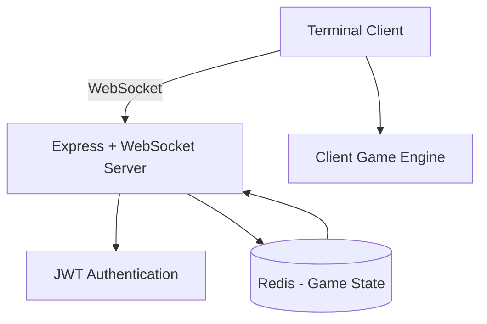

# CLI Invader

CLI Invader is a real-time multiplayer terminal game built to explore **event-driven architecture, WebSocket communication, distributed state management, and real-time rendering systems** in Node.js.

The system is designed to be fast, reliable, and playable entirely from the terminal.
It is composed of two main entities:

- A **stateless WebSocket backend server**
- A **terminal-based multiplayer game client** containing a custom rendering engine and collision system

---

## Key Highlights

- Real-time multiplayer gameplay using WebSockets
- Stateless distributed backend architecture
- Redis-backed persistent game state
- JWT-based authentication
- Custom terminal rendering engine
- AABB-based collision detection algorithm
- Synchronization of up to 6 players per session
- Designed to support thousands of concurrent connections

---

## Tech Stack

### Backend
- Node.js
- Express.js
- express-ws
- Redis
- JWT Authentication

### Client
- Node.js
- Terminal stdout rendering
- Custom coordinate rendering engine
- AABB collision detection

---

## System Architecture



---

## Architecture Overview

### Stateless Server Design

The backend does **not store game state in server memory**.

Instead:

- All session and game state data is stored in **Redis**
- The server remains stateless
- Game sessions remain synchronized across all connected clients
- The architecture allows horizontal scalability and improved fault tolerance

---

### Real-Time Communication Layer

- Implemented using **Express.js + express-ws**
- WebSocket endpoints manage:
  - Player connections
  - Player actions
  - Real-time game state updates
- Server broadcasts synchronized state updates to all connected players

---

### Authentication & Security

- JWT-based authentication
- Secure WebSocket handshake validation
- Stateless token verification

No session storage is required.

---

## Client Architecture (Terminal Game Engine)

The client includes a lightweight game engine responsible for:

- Rendering
- Collision detection
- Player input handling
- Real-time synchronization with the server

### Rendering Engine

- Coordinate-based rendering system
- Direct stdout manipulation
- Frame-by-frame redraw logic
- Optimized terminal refresh system for smooth gameplay

---

### Collision Detection

Collision detection is implemented using a customized **AABB (Axis-Aligned Bounding Box)** algorithm:

- Hitboxes defined using coordinate ranges
- Fast bounding-box intersection checks
- Supports multiple simultaneous moving entities
- Ensures accurate real-time gameplay interactions

---

## Project Structure

```
server/
  ├── websocket handlers
  ├── authentication modules
  ├── redis state manager
  └── API routes

client/
  ├── rendering engine
  ├── collision system
  ├── input handler
  └── websocket client
```

---

## Performance Characteristics

- Supports thousands of simultaneous WebSocket connections
- Synchronizes hundreds of parallel game sessions
- Redis enables fast state reads and atomic updates
- Lightweight network protocol minimizes latency
- Efficient rendering loop reduces terminal flickering

---

## Installation

```bash
git clone https://github.com/ChrysArex/cli_invader.git
cd cli_invader
npm install
```

---

## Running the System

Start the server:

```bash
npm run start-server
```

Start the client:

```bash
npm run start-client
```

---

## Engineering Concepts Demonstrated

- Event-driven architecture
- Real-time system synchronization
- Distributed state management
- Stateless backend scalability
- WebSocket protocol implementation
- Terminal rendering engine design
- Collision detection algorithms
- Performance optimization in Node.js

---

## Why This Project Matters

CLI Invader demonstrates the ability to design and implement a **distributed real-time system**, not only a traditional REST backend.

It reflects practical experience with:

- High-concurrency backend systems
- Multiplayer synchronization challenges
- Distributed architecture design
- Algorithmic performance optimization

These patterns are commonly used in:

- Multiplayer platforms
- Real-time collaboration tools
- Financial streaming platforms
- Live dashboards
- Gaming infrastructure

---

## Author

**Arix Azokly**
Backend Engineer — Real-Time Systems, Distributed Architecture, SaaS Platforms
GitHub: https://github.com/ChrysArex
